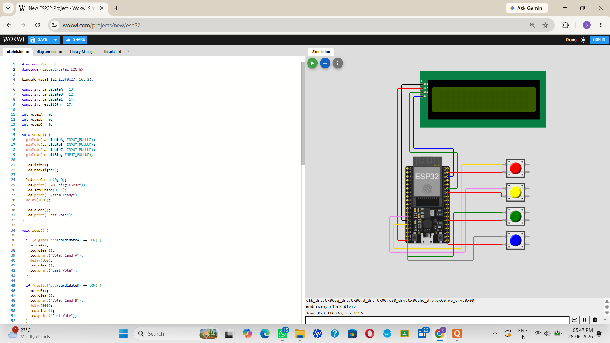
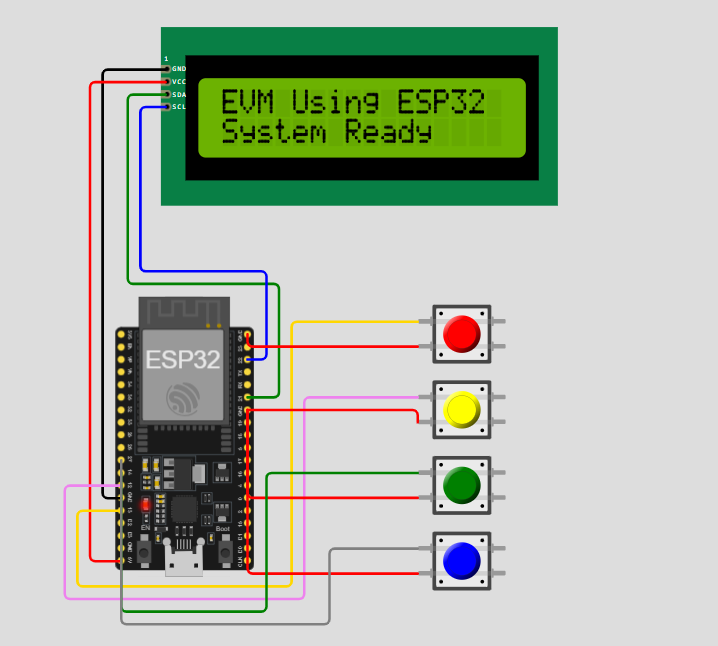
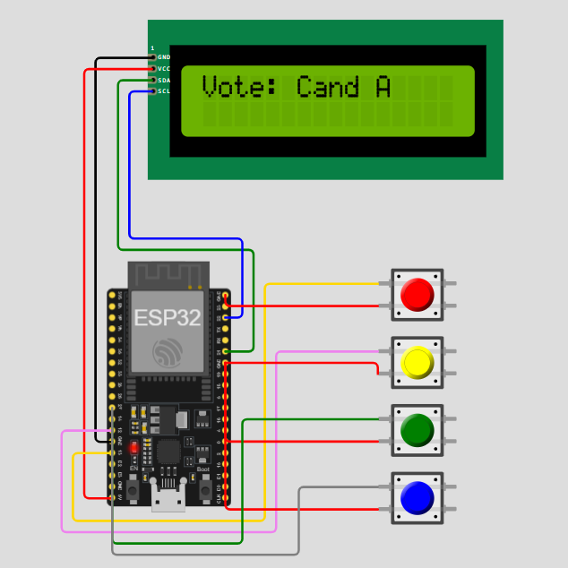
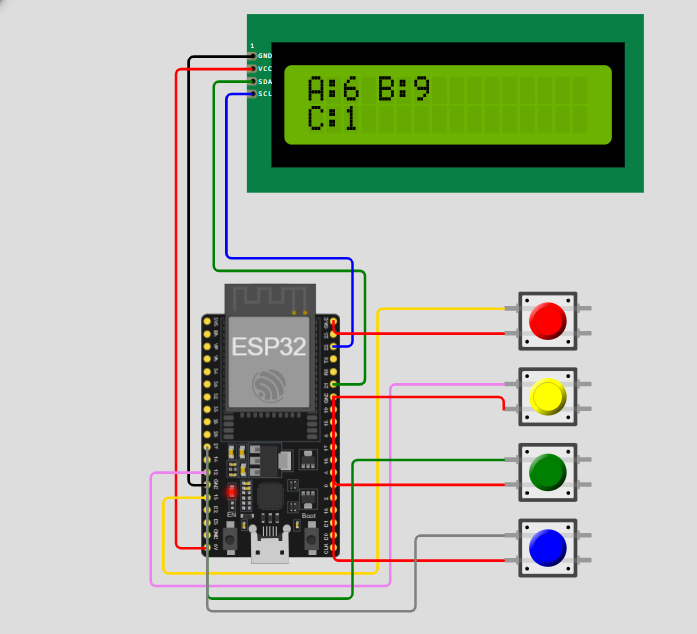

# Electronic Voting Machine Using ESP32 and 16x2 I2C LCD

## Internship Details

**Company:** CodTech IT Solutions

**Intern Name:** Bhumika Dipak Ijare

**Intern ID:** CITS3830

**Domain:** Embedded Systems

## Project Overview

This project demonstrates the implementation of an Electronic Voting Machine (EVM) using an ESP32 microcontroller and a 16x2 I2C LCD Display. The system allows users to cast votes for different candidates using push buttons. The votes are counted electronically and displayed on the LCD when the result button is pressed.

The project was developed and simulated using the Wokwi Simulator and serves as a practical embedded systems application demonstrating digital input handling and vote counting logic.

## Project Screenshot

## Components Required

* ESP32 DevKit V1
* 16x2 I2C LCD Display
* Push Buttons (4)
* Jumper Wires

## Circuit Connections

### LCD Connections

| LCD Pin | ESP32 Pin |
| ------- | --------- |
| VCC     | VIN       |
| GND     | GND       |
| SDA     | GPIO 21   |
| SCL     | GPIO 22   |

### Push Button Connections

| Button        | ESP32 Pin |
| ------------- | --------- |
| Candidate A   | GPIO 13   |
| Candidate B   | GPIO 12   |
| Candidate C   | GPIO 14   |
| Result Button | GPIO 27   |

The other terminal of each push button is connected to GND.

## Working Principle

The ESP32 continuously monitors the status of four push buttons. Three buttons are assigned to individual candidates and one button is assigned to display the election results.

When a candidate button is pressed, the corresponding vote count is incremented and a confirmation message is displayed on the LCD. When the result button is pressed, the LCD displays the total votes received by each candidate.

The system uses the ESP32's internal pull-up resistors for reliable button input detection.

## Output Format

Vote Recording:

Candidate A Voted

Result Display:

A:5 B:3
C:2

## Features

* Electronic Vote Counting
* Real-Time Vote Recording
* LCD-Based User Interface
* Result Display on Demand
* Simple and User-Friendly Design
* ESP32-Based Implementation

## Applications

* School Elections
* College Elections
* Digital Voting Demonstrations
* Embedded Systems Learning
* Educational Projects

## Software Used

* Arduino IDE
* Wokwi Simulator
* GitHub

## Source Code

The ESP32 program reads push button inputs, maintains vote counters for each candidate, and displays vote information and election results on the LCD display.

## Future Enhancements

* RFID-Based Voter Authentication
* Fingerprint Verification System
* Wireless Result Transmission
* Cloud-Based Vote Monitoring
* Secure Database Storage

## Repository Structure

ESP32_Electronic_Voting_Machine
* sketch.ino
* diagram.json
* README.md
* screenshot.png

## Author

**Bhumika Dipak Ijare**
Electronics and Communication Engineering

## Acknowledgement

This project was completed as part of the CodTech IT Solutions Internship Program under the Embedded Systems domain.
